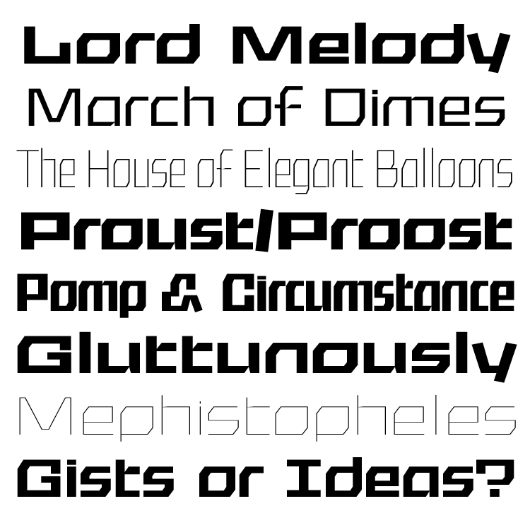

# Crispy
___

**Crispy** is a variable font, designed by Agyei Archer for Google Fonts and licensed under the [SIL Open Font License, 1.1](http://scripts.sil.org/OFL).

Crispy's variations are created based on Font Bureau and David Berlow's [variations proposal](https://variationsguide.typenetwork.com/), which outlined the descriptions of font features using more elemental factors than the more common paradigms like weight, width, x-height, etc.

Crispy is a typeface designed for applications where headline content needs to take primary importance. Its parametric design makes it applicable to a spectrum of eccentricity that makes it usable for headlines of all flav*ou*rs. Initially this focus was a good excuse to make it uppercase only, but a lowercase has since been added to increase range of future usability.

Development and design for this typeface project is sponsored by Google Fonts, and in the future it may be available in Google Fonts. Until then, this respository is the best place to download the latest usable files.

### Planned Axes:

| Axis Name       | Axis Label | Axis Type     | Min Value    | Max Value |
| :-------------  | :--------- | :-----------  | -----------: | --------: |
|  X-Opacity      | XTRA       | Parametric    | 1            | 1000      |
|  Y-Opacity      | YTRA       | Parametric    | 1            | 1000      |
|  X-Transparency | YTRA       | Parametric    | 1            | 1000      |
|  Weight         | wght       | Stylistic     | 1            | 1000      |
|  Width          | wdth       | Stylistic     | 1            | 1000      |
|  Grade          | GRAD       | Stylistic     | -0.5         | 0.5       |
|  Slant          | slnt       | Stylistic     | -1           | 1         |
|  Shadow         | shdw       | Stylistic     | 0            | 1         |

¹Dependent on automation using a modified Slanter fork.

²Dependent on Python scripting that is still, how you say...."in progress"

___
**For the purposes of this project, I describe *axes* as visual paradigms that we use to describe one or more features in a variable font.**

I describe *parametric axes* as elemental axes that we can use to describe one structural or aesthetic component of a typeface. 

I describe *stylistic axes* are axes that we can use to describe the end-result of more than one of these elemental factors, expressed to different individual degrees at the same time. 

By these descriptions, we can think of ***Weight*** as a stylistic axis that can be expressed as a combination of ***X-Opacity***, ***Y-Opacity***, ***Y-Transparency***, and ***X-Transparency***. We know then that, typically, a Latin typeface with conventional contrast will have a greater ratio of X-Opacity to Y-Opacity, at least visually, if not numerically. 

Immediately, we can flag this idea of "conventional contrast" as potentially limiting, and a demonstrable indication of the long-term conceptual and semantic advantage of thinking of fonts parametrically, especially in global typographic applications where we would want to avoid positioning Latin-centric paradigms as default or industry standards. Right? 🙄

Anyway,

___

### Designer:
* Agyei Archer

### License:
Copyright (c) 2021, Agyei Archer Limited (hello@agyei.design | [agyei.design]() )

Licensed under the [SIL Open Font License, 1.1](http://scripts.sil.org/OFL); you may not use this file except in compliance with the License.

___

## Font Log:

Crispy is a variable font that supports [Google Latin Pro](https://github.com/googlefonts/gftools/blob/master/Lib/gftools/encodings/GF%20Glyph%20Sets/GF-latin-pro_unique-glyphs.nam) glyph set, with a total of 713 core glyphs in each of its 8 master font files.

### File Setup:

**The master files are configured below as follows:**

| Master Name   | XOPQ | YOPQ     | XTRA |
| :------------- | :---------- | ----------- | -----------: |
|  x0y0t0 | 1   | 1    | 1 |
|  x0y0t1000 | 1   | 1    | 1000 |
|  x1000y0t0 | 1000   | 1    | 1 |
|  x0y1000t0 | 1   | 1000    | 1 |
|  x1000y0t1000 | 1000   | 1000    | 1000 |
|  x0y1000t1000 | 1   | 1000    | 1000 |
|  Crispy Support: Medium Condensed³ | 174.5   | 320    | 20 |
|  Crispy Support: Medium Extended³ | 410   | 475    | 450 |

These master files were first made in Robofont, but are now being produced in Glyphs for more speed, using Robofont and Skateboard to visualise changes for nuanced axe such as grade, and Robofont Scripts, DesignSpace files, and Fontmake-specific tools to generate the exported file.

The logic is:
1. Masters are designed and edited in Glyphs (manual)
2. These masters are exported in .ufo format and VF instances are created and managed by Robofont + Skateboard (manual) 
3. The necessary instances to be used for masters for Grade, Weight, and Width will be generated in min/max grade pairs per style. (manual)
4. These instances are handled by Robofont and Skateboard using a designspace file, and masters for Stylistic versions are exported (automated/scripted)
4. The final instances that include configurations for both Stylistic and Parametric axes are exported, in additions to checks for matching widths on grade masters and tools like ttfautohunt being applied.

The Current output file should support and include masters for:

* Width: Min/Max
* Weight: Min/max
* Grade: Min/max
* XTRA: Min/Max
* XOPQ: Min/Max
* YOPQ: Min/Max

*Still to be added:*

* Shadow: Min/Max
* Slant: Min/Max

*³ Support files were added to have more control over certain font features such as diagonals and areas where weight management needed more nuanced control. Because of the nature of the font files used, it's also easier to use these files to preview and design test cases for more complicated glyphs.*

The second designspace file manages the stylistic definitions based on the files exported on building the first file. This file is where details such as glyph substitutions, and style definitions as outlined for specifications like [usWeightClass](https://docs.microsoft.com/en-us/typography/opentype/spec/os2#usweightclass) and [usWidthClass](https://docs.microsoft.com/en-us/typography/opentype/spec/os2#uswidthclass). 

### Ideal build:

The masters asociated with these file are only handled on export by fontmake, and the build process is currently automated to cover:

1. Building parametric instances i.e. stylistic sources
2. Compensating for possible grade-related advance width issues
3. Building stylistic sources
4. ttfautohint and other builtin fontmake checks
2. Building well-labeled versions of static .ttf and .woff files
3. Building variable font

***The ideal build will cover:***

1. Building parametric instances i.e. stylistic sources
2. Compensating for possible grade-related advance width issues
3. Building stylistic sources
4. ttfautohint and other builtin fontmake checks
2. Building well-labeled versions of static .ttf and .woff files
3. Building variable font
4. *Automated static and animated proofs with drawbot*
5. *Automated, well-labelled git push* ⁴

⁴ Currently `git push` triggers [FontBakery](https://github.com/googlefonts/fontbakery/) QA checks. Fontbakery MarkDown generation creates a simple readable report on font errors following this, to help move the font files toward completion.

### Glyphs + :

### Design log:
* December 2021: math symbols completed, Design sources moved to Glyphs
* December 2020: lowercase parametric versions completed and merged
* March 2020: design direction completed and proportions resolved
* Juneish 2019: design initiated

### Roadmap:
* Combining marks - completed and reviewed (March 2022)
* Math Symbol filtering - completed and reviewed (March 2022)
* Final Design review incl. Combined marks - completed (March 2022)
* GlyphConstruction & Full Language support (April 2022)
* Kerning (May 2022) - to be done with Kern-On in Glyphs

### Acknowledgements

**David Jonathan Ross: Design Advisor** | david@djr.com | [http://djr.com/](http://djr.com/)

**Eben Sorkin: Design Advisor** | eben@eyebytes.com | [http://sorkintype.com/](http://sorkintype.com/)

**Tanya George: Design Production** | tanya@tanyatypes.com | [https://tanyatypes.wordpress.com/
](https://tanyatypes.wordpress.com/)

**Agyei Archer: Designer** | hello@agyei.design | [http://agyei.design]()

**David Berlow: Parametric Design Theorist & Pioneer**** [http://davidberlow.fontbureau.com/](http://davidberlow.fontbureau.com/)
